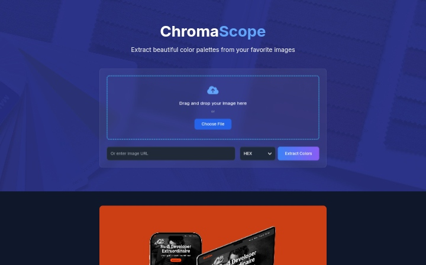
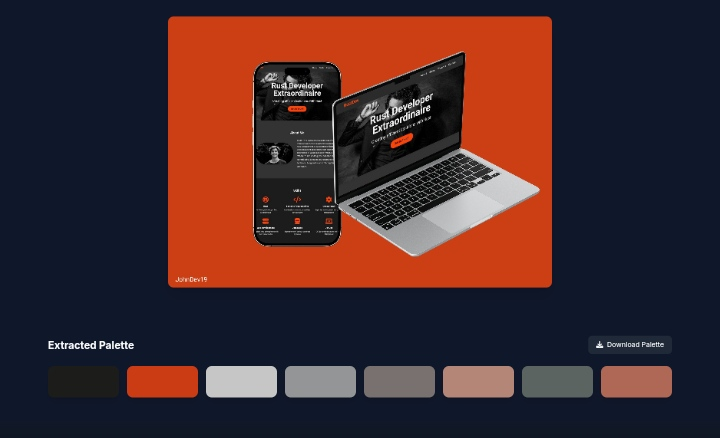

# 🎨 ChromaScope: Color Palette Extraction Tool

## Overview

ChromaScope is a just a simple web application that allows users to extract color palettes from images.

## 🌟 Features

- **Drag and Drop Image Upload**: Upload images directly from your computer
- **URL Image Support**: Extract colors from online images by providing a URL
- **Smart Color Extraction**:  Algorithm detects dominant and accent colors
- **Multiple Color Formats**: Export colors in HEX, RGB, and HSL formats
- **Color Name Detection**: Get descriptive names for extracted colors
- **Palette Download**: Download palettes in TXT, CSS, and PNG formats

## 🚀 Technologies

- React
- ColorThief Library
- TheColorAPI
- Tailwind CSS
- FontAwesome Icons

## 🤖 How It Works

1. Upload an image via drag and drop or URL
2. Click "Extract Colors"
3. View and interact with your color palette
4. Copy individual colors or download the entire palette

## 🌈 Color Extraction Methods

- Dominant color detection
- Accent color identification
- Smart color naming
- Multiple format conversion (HEX, RGB, HSL)

## 📦 Available Downloads

- TXT: Color names and values
- CSS: CSS custom properties
- PNG: Visual color palette

## 🤝 Contributing

Contributions are welcome! Please feel free to submit a Pull Request.

## 📝 License

Distributed under the MIT License. See [LICENSE](LICENSE) for more information.
